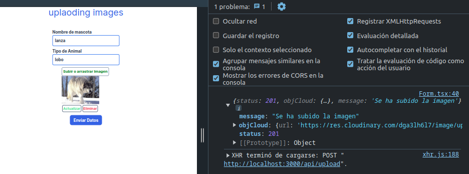
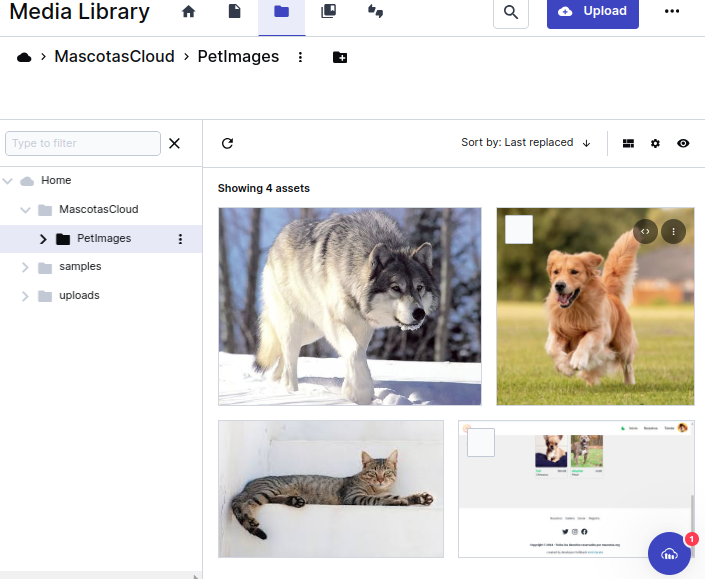

# UPLOADING IMAGES WITCH CLOUDINARY

Proyecto de subida de imagens usando el framework de nextjs a cloudinary

#### Tecnolologias y Dependencias

- nextjs
- cloudinary
- axios
- taildwind css
- typescript

### Getting Started

Debe correr el server en:

```bash
npm run dev
# or
yarn dev

```

#### Repuesta del server



### Estructura del proyecto

```bash
├── .env.local
├── src
│   ├── app
│   │   └── api
│   │       └── upload
│   │           └── route.ts
│   ├── components
│   │   ├── Form.tsx
│   │   └── FormImages.tsx
│   └── utils
│       └── cloudinary.ts

```

## Api - backend

Dentro de nextjs podemos tener su propia api con los archivos route.ts

```javascript
import { cloudinary, uploadCloudinary } from "@/utils/cloudinary";


//===========RUTA POST================================
export const POST = async (req: Request, res: Response) => {
  try {
    const formData = await req.formData();
    let file = formData.get("file") as File;

    const result = await uploadCloudinary(file);

    const objCloud = {
      url: result,
      name: formData.get("name"),
      type_pet: formData.get("type_pet"),
    };

    return Response.json({
      status: 201,
      objCloud,
      message: "Se ha subido la imagen",
    });
  } catch (error) {
    if (error instanceof Error) {
      console.log(error.message);
    }
  }
};

//====RUTA  GET============
export const GET = () => {
  return Response.json("Welcome uplaod");
};

```

#### Cloudinary API

```javascript
import { v2 as cloudinary } from "cloudinary";
import path from "path";
import fs from "fs";

// Configuration
cloudinary.config({
  cloud_name: `${process.env.CLOUD_NAME}`,
  api_key: `${process.env.API_KEY}`,
  api_secret: `${process.env.API_SECRET}`,
  secure: true,
});

export { cloudinary };

const folderName = "MascotasCloud";
const subfolder = "PetImages";

//==============en nextjs se maneja asi ==================

//opciones

export const uploadCloudinary = async (file: File) => {
  try {
    const { size, type, name } = file; //destructuring file
    const filename = path.basename(name); //creo un filename usando el mismo nombre
    const publicId = folderName
      ? `${folderName}/${subfolder}/${filename}`
      : filename;

    //===================converter buffer=============================================
    const arrayBuffer = await file.arrayBuffer();
    const buffer = new Uint8Array(arrayBuffer);

    //================================================================
    //resolviendo promesa
    const result = await new Promise((resolve, reject) => {
      //=============inicio de callback=======================
      const upload = cloudinary.uploader.upload_stream(
        {
          public_id: publicId,
          transformation: {
            width: 500,
            height: 500,
            crop: "limit",
            quality: "auto",
            // gravity: "auto",
          },
        },
        (error, result) => {
          if (error) {
            // console.log(error.message);
            return reject(error);
          } else {
            // console.log(result);
            return resolve(result?.secure_url);
          }
        }
      );
      upload.end(buffer);
      //==========fin del calback================
    });

    return result;
  } catch (error) {
    if (error instanceof Error) {
      console.log(error.message);
    }
  }
};
```

#### Cloudinary folder



#### .ENVIRONMENT

Se debe tener un archivo .env con la `secret` `key` y `name` de su cloudinary

```javascript

 #ejemplo deformato de variables de cloudinary

 CLOUD_NAME= dgerhl
 API_KEY= 628767896789113821
 API_SECRET= cljjhfdkKMhdxwmXLz-ur-YIRZA
```

## Client

Seria la parte de page.tsx (index), y components

#### FormImages.tsx

```javascript
"use client";

import React, { useState } from "react";

import ImageUploading, {
  ImageListType,
  ImageType,
} from "react-images-uploading";

//nota aunque en mi caso el numero maximo de imagenes sea 1 , igual lo hago array
type PropsImages = {
  image: ImageType | null,
  setImage: (image: ImageType | null) => void,
};

const FormImages: React.FC<PropsImages> = ({ image, setImage }) => {
  const maxNumber = 1; //maximo numero de imagenes para subir
  // const [imagelocal, setImageLocal] = useState<ImageType | null>();
  const onChange = (
    imageList: ImageType
    // addUpdateIndex: number[] | undefined
  ) => {
    if (imageList.length > 0) {
      setImage(imageList[0]);
    } else {
      setImage(null);
    }
  };

  return (
    <>
      <ImageUploading
        multiple //multiple images
        value={image ? [image] : []}
        onChange={onChange}
        maxNumber={maxNumber}
      >
        {({
          imageList,
          onImageUpload,
          onImageRemoveAll,
          onImageUpdate,
          onImageRemove,
          isDragging,
          dragProps,
          errors,
        }) => (
          // write your building UI
          <div className="upload__image-wrapper">
            <button
              style={
                isDragging
                  ? { color: "red", fontWeight: "bold", fontSize: "15px" }
                  : { color: "green", fontWeight: "bold", fontSize: "15px" }
              }
              {...(isDragging ? dragProps : {})}
              onClick={onImageUpload}
              {...dragProps}
              className="border-2 border-slate-400 p-1 rounded-md"
            >
              {isDragging ? "arrastrando imagen" : "Subir o arrastrar Imagen"}
            </button>
            &nbsp;
            {/*  <button onClick={onImageRemoveAll}>Remove all images</button> */}
            {errors && (
              <div className="font-semibold text-red-500 text-sm">
                {errors.maxNumber && (
                  <span>Solo puede seleccionar una sola imagen</span>
                )}
                {errors.acceptType && (
                  <span>Tipo invalido seleccione una imagen valida</span>
                )}
                {errors.maxFileSize && <span>Imagen demasiada grande</span>}
                {/*
                {errors.resolution && (
                  <span>
                    Selected file does not match your desired resolution
                  </span>
                )}
               */}
              </div>
            )}
            {imageList.map((image, index) => (
              <div key={index} className="image-item">
                
                <div className="text-sm font-semibold my-1  ">
                  <button
                    onClick={() => onImageUpdate(index)}
                    className="border-2 border-slate-500 text-green-400 rounded-md p-0.5 mx-0.5 "
                  >
                    Actualizar
                  </button>
                  <button
                    onClick={() => onImageRemove(index)}
                    className="border-2 border-slate-500  text-red-500 rounded-md p-0.5 mx-0.5 "
                  >
                    Eliminar
                  </button>
                </div>
              </div>
            ))}
          </div>
        )}
      </ImageUploading>
    </>
  );
};

export default FormImages;
```

#### Form.tsx

```javascript
"use client";

import React, { useState } from "react";
import FormImages from "./FormImages";
import { ImageType, ImageListType } from "react-images-uploading";
import axios from "axios";

interface TypeForm {
  name: string;
  type_pet: string;
  file: ImageType | null;
}

const Form = () => {
  let [data, setData] = useState({
    name: "",
    type_pet: "",
  });
  const [file, setFile] = (useState < ImageType) | (null > null);

  const handleChange = (e: React.ChangeEvent<HTMLInputElement>) => {
    const { name, value } = e.target;
    //console.log(name, value);

    setData({
      ...data,
      [name]: value,
    });
  };

  const SendData = async (formData: FormData) => {
    try {
      const res = await axios.post("/api/upload", formData, {
        headers: {
          "Content-Type": "multipart/form-data",
        },
      });

      const exit = await res.data;
      console.log(exit);
      return exit;
    } catch (error) {
      console.log(error);
    }
  };

  const handleSubmit = async (e: React.ChangeEvent<HTMLFormElement>) => {
    e.preventDefault();

    try {
      const formData = new FormData();

      formData.append("name", data.name);
      formData.append("type_pet", data.type_pet);

      let fileSelected = file?.file;
      if (fileSelected instanceof File) {
        formData.append("file", fileSelected);
      }

      // console.log(formData.get("name") + "   " + formData.get("type_pet"));
      //console.log(formData.get("file"));

      SendData(formData);
    } catch (error) {
      if (error instanceof Error) {
        console.log(error.message);
      }
    }
  };

  return (
    <div className="my-10 py-2 ">
      <form
        onSubmit={handleSubmit}
        className="flex flex-col  items-center gap-2"
      >
        <div className="text-slate-700 font-bold">
          <label htmlFor="nameId" className="flex justify-start">
            Nombre de mascota
          </label>
          <input
            id="nameId"
            type="text"
            name="name"
            onChange={handleChange}
            value={data.name}
            className="border-2 border-blue-500 rounded-md p-2"
          />
        </div>

        <div className="text-slate-700 font-bold">
          <label htmlFor="type_pet" className="flex justify-start">
            Tipo de Animal
          </label>
          <input
            id="type_pet"
            type="text"
            name="type_pet"
            onChange={handleChange}
            value={data.type_pet}
            className="border-2 border-blue-500 rounded-md p-2"
          />
        </div>

        <FormImages image={file} setImage={setFile} />

        <div className="">
          <button
            type="submit"
            className=" font-bold  bg-blue-600 text-white w-32 py-2 rounded-lg"
          >
            Enviar Datos
          </button>
        </div>
      </form>
    </div>
  );
};

export default Form;
```

### Documentacion

- `https://cloudinary.com/documentation/upload_assets_with_server_actions_nextjs_tutorial`
